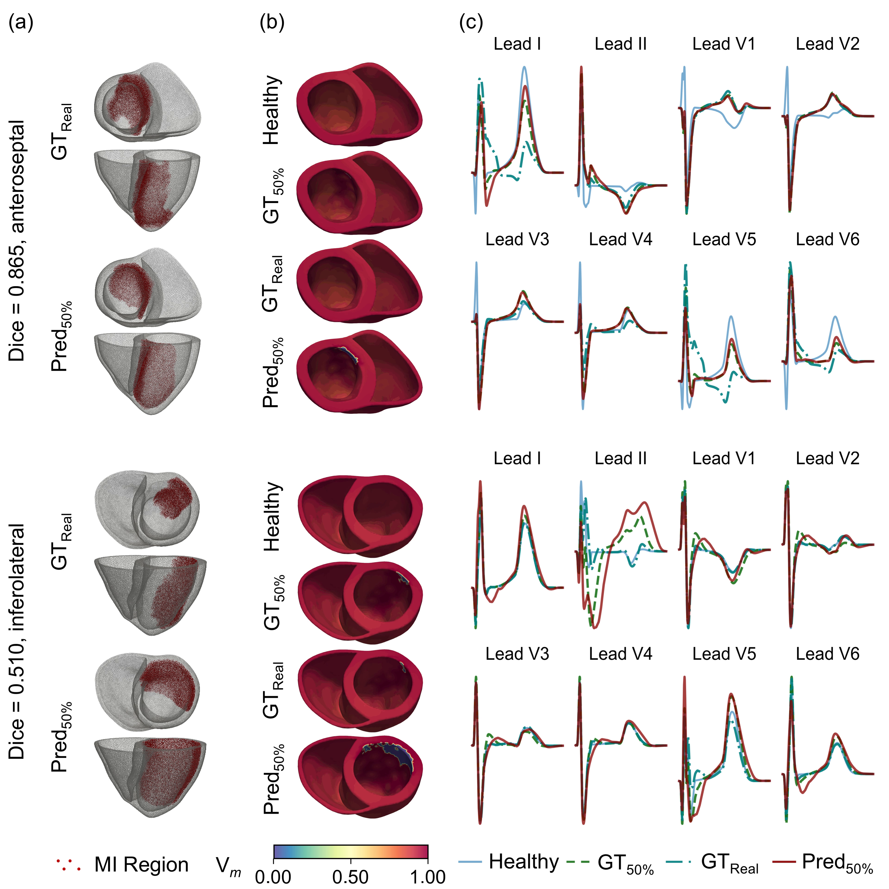

# GeoMo-Net
Official implementation of GeoMo-Net for contrast-free 3D myocardial infarct reconstruction from cine MRI.

The complete source code and pretrained models will be released upon acceptance.

