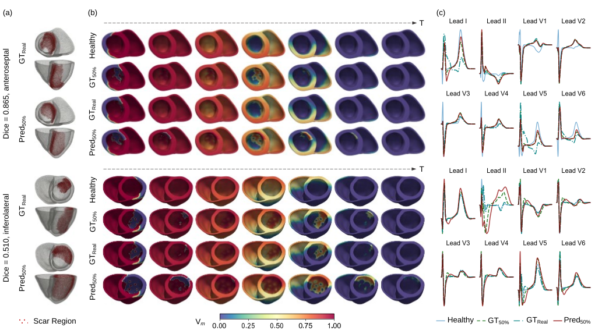

Official implementation of GeoMo-Net for contrast-free 3D myocardial infarct reconstruction from cine MRI.

## Overview

GeoMo-Net is a contrast-free framework for reconstructing personalized 3D myocardial infarct geometry directly from multi-view cine MRI. It combines patient-specific cardiac geometry with myocardial motion on a topology-consistent 4D biventricular mesh and predicts infarct regions at the node level. The complete source code and pretrained models will be released upon acceptance.

## Framework

GeoMo-Net first reconstructs a topology-consistent 4D biventricular mesh from multi-view cine MRI. Geometry-aware features characterize cardiac shape and anatomical location, while motion-aware features describe myocardial deformation throughout the cardiac cycle. The two representations are adaptively fused and modeled spatiotemporally for node-level infarct reconstruction.

## Results

  

Representative cases illustrate infarcts with different locations, scar burdens, and reconstruction accuracies. The reconstructed 3D scars are projected back to the cine MRI for image-space visualization, while bull's-eye maps compare segment-level scar burden with the LGE-derived ground truth.

## Downstream Task

  

[▶ View animated Vm and ECG](https://LYL-asdf.github.io/GeoMo-Net/source/view_video.html)

GeoMo-Net-predicted scars reproduce scar-induced changes in transmembrane potential propagation, including regional conduction delay and block. The corresponding simulated ECGs also recover lead-specific morphological changes observed with the LGE-derived scar models.
